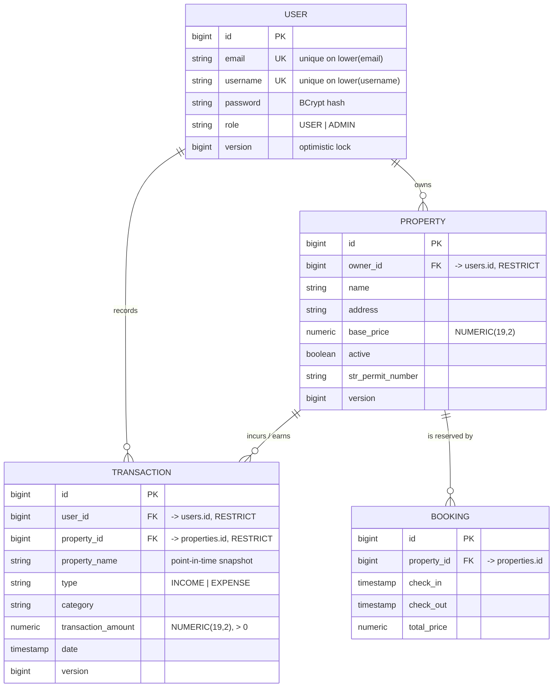

# PropFlow API

[](https://github.com/HoseaCodes/PropFlow-API/actions/workflows/ci.yml)

A REST API for managing short-term rental properties and their financial transactions — properties, income and expense records, tax categorisation, and recurring charges.

> **Status: portfolio project, actively being hardened.**
>
> This repository is mid-way through a documented engineering review. A full audit of its original weaknesses is published in [`docs/ENGINEERING_AUDIT.md`](docs/ENGINEERING_AUDIT.md), and the remediation plan is in [`docs/PORTFOLIO_HARDENING_PLAN.md`](docs/PORTFOLIO_HARDENING_PLAN.md).
>
> This README documents only what the code actually does today; capabilities are added here as they land.

---

## Tech Stack

- Java 17
- Spring Boot 3.4.0
- Spring Security 6 with stateless JWT bearer authentication
- Spring Data JPA / Hibernate 6
- PostgreSQL 15
- Flyway (schema migrations)
- Maven (wrapper included)
- Docker / Docker Compose
- Testcontainers (integration tests against real PostgreSQL)
- Spring Boot Actuator + Micrometer/Prometheus
- springdoc-openapi (Swagger UI)
- GitHub Actions
- Lombok

---

## Domain Model



Every relationship is a real foreign key with `ON DELETE RESTRICT`. Deleting a user who still owns properties, or a property that still has transactions, is refused by the database rather than silently orphaning financial history — the API surfaces that as `409`.

`property_name` on a transaction is deliberately denormalised: a financial record should show the name in force when it was written, so renaming a property does not rewrite past statements.

`Booking` entity and table also exist, with a proper foreign key to `properties`, but no API is exposed for it yet. The unused `Expense` and `CleaningChecklist` entities were removed — `Expense` duplicated `Transaction`, and neither had any endpoint.

---

## API

Base URL: `http://localhost:8080`

Every endpoint requires a bearer token except `POST /api/auth/signup`, `POST /api/auth/signin`, and the OpenAPI paths. Unauthenticated requests receive `401`; authenticated requests lacking the required role receive `403`. Both are RFC 7807 `application/problem+json`.

**Every property and transaction read is scoped to the authenticated owner.** Requesting a resource that belongs to someone else returns **`404`, not `403`** — a 403 would confirm the id exists and let an attacker enumerate the id space. Scoping is applied inside the query (`findByIdAndOwner`, and an ownership `Specification` on transactions) rather than as a check after loading, so a forgotten scope fails closed. Accounts with the `ADMIN` role read across owners.

```bash
TOKEN=$(curl -s -X POST http://localhost:8080/api/auth/signin \
  -H 'Content-Type: application/json' \
  -d '{"username":"you","password":"your-password"}' | jq -r .accessToken)

curl http://localhost:8080/api/properties -H "Authorization: Bearer $TOKEN"
```

### Authentication (public)
| Method | Path | Notes |
|---|---|---|
| `POST` | `/api/auth/signup` | Creates a user; BCrypt-hashed password; returns `201` and never returns credentials |
| `POST` | `/api/auth/signin` | Returns a signed JWT, its type, its lifetime, and the user |

### Properties
| Method | Path | Success | Notes |
|---|---|---|---|
| `GET` | `/api/properties` | `200` | Paged: `?page=&size=&sort=`. Default size 20, max 100. |
| `GET` | `/api/properties/{id}` | `200` | `404` if unknown |
| `POST` | `/api/properties` | `201` | Validated; returns `Location` |
| `PUT` | `/api/properties/{id}` | `200` | Validated; full replacement |
| `DELETE` | `/api/properties/{id}` | `204` | `404` if unknown |

Paged responses use a stable envelope rather than Spring's `PageImpl`:

```json
{ "content": [ ... ], "page": 0, "size": 20, "totalElements": 42, "totalPages": 3, "last": false }
```

### Transactions
| Method | Path | Success | Notes |
|---|---|---|---|
| `GET` | `/api/transactions` | `200` | Paged summaries |
| `GET` | `/api/transactions/{id}` | `200` | Full record incl. tags and metadata |
| `GET` | `/api/transactions/property/{propertyId}` | `200` | Paged |
| `POST` | `/api/transactions` | `201` | Owner taken from the token, not the body |
| `PUT` | `/api/transactions/{id}` | `200` | Partial-safe: unsent fields are preserved |
| `DELETE` | `/api/transactions/{id}` | `204` | |
| `POST` | `/api/transactions/search` | `200` | 16 optional filters, paged and sorted |

List endpoints return **summaries** without tags, warranties, or metadata; the detail endpoint returns the full record. Those are lazy collections, so including them in a listing would cost up to three extra queries per row. An integration test asserts a 5-row page issues at most 2 SQL statements.

`POST` is used for search deliberately: sixteen optional criteria including free text and date ranges do not encode comfortably as query parameters. The cost is that the response is not cacheable.

Recording an `INCOME` transaction in an expense category (or vice versa) returns **422** — every field is individually valid, but the combination violates a domain rule.

### Users
| Method | Path | Required role |
|---|---|---|
| `GET` | `/api/users/me` | any authenticated user |
| `GET` | `/api/users` | `ADMIN` |
| `GET` | `/api/users/{id}` | `ADMIN` |
| `DELETE` | `/api/users/{id}` | `ADMIN` |

`POST /api/users` and `PUT /api/users/{id}` were **removed**. The first persisted passwords without hashing and duplicated signup; the second bound the JPA entity directly and saved it under the path's id with no ownership check, so any caller could rewrite any account's credentials. Safe replacements arrive with the DTO work.

A Postman collection covering the auth and user endpoints is at [`src/main/resources/postman.json`](src/main/resources/postman.json).

---

## Local Development

### Prerequisites
- JDK 17+
- Docker (for PostgreSQL)

### 1. Clone and configure

```bash
git clone https://github.com/HoseaCodes/PropFlow-API.git
cd PropFlow-API
cp .env.example .env
```

`.env.example` contains placeholders only. The defaults point at the Docker Compose database and are throwaway local values, not secrets. If port 5432 is already in use on your machine, set `DB_HOST_PORT` in `.env` and update the port in `DB_URL` to match.

### 2. Start PostgreSQL

```bash
docker compose up -d db
```

> If you change `POSTGRES_USER` / `POSTGRES_PASSWORD` after the volume already exists, PostgreSQL will ignore them — those variables only apply when it initialises an empty data directory. Reset with `docker compose down -v`, which **deletes the local database volume**.

### 3. Run the application

```bash
./mvnw spring-boot:run
```

The API listens on `http://localhost:8080`.

Flyway applies the migrations in [`src/main/resources/db/migration`](src/main/resources/db/migration) automatically at startup, in version order. Hibernate runs with `ddl-auto=validate`: it verifies that the entity mappings match the migrated schema and refuses to start if they have drifted, but never modifies the schema itself.

### 4. Run the tests

```bash
./mvnw test      # unit tests only — fast, no Docker required
./mvnw verify    # unit + integration tests — starts a PostgreSQL container
```

Tests are split into two tiers:

| Tier | Naming | Runner | What it covers |
|---|---|---|---|
| **Unit** | `*Test` | Surefire (`mvn test`) | Pure logic — no Spring context, no database. Runs in well under a second. |
| **Integration** | `*IT` | Failsafe (`mvn verify`) | Full stack: HTTP → controller → service → repository → real PostgreSQL. |

Integration tests run against **PostgreSQL in Docker via Testcontainers**, not an in-memory database. An in-memory database in "PostgreSQL compatibility mode" is not PostgreSQL — it diverges on type coercion, constraint semantics, sequences, `NUMERIC` precision, and SQL dialect — so a test that passes against it is not evidence about the database this application actually deploys on.

The container is started once per JVM and shared across all integration test classes, and Flyway migrates the fresh database on first startup. Every run is therefore continuous proof that the migrations apply cleanly from nothing.

You do **not** need `docker compose up -d db` to run the tests; Testcontainers manages its own database. Only Docker itself is required.

### Full stack in Docker

```bash
docker compose up --build
```

Starts PostgreSQL, the API, and [Adminer](http://localhost:8082) for browsing the database. The app container waits for the database to report healthy before starting, and has its own healthcheck against the readiness probe.

`JWT_SECRET` has no default: Compose fails with an explanatory message rather than booting with a signing key committed to this repository.

---

## API Documentation

With the application running:

| | |
|---|---|
| Swagger UI | <http://localhost:8080/swagger-ui.html> |
| OpenAPI JSON | <http://localhost:8080/v3/api-docs> |

The spec is generated from the controllers and the validation constraints on the request records, so it cannot drift from the code — which is why endpoint details are not duplicated at length here.

To exercise protected endpoints: sign in via `POST /api/auth/signin`, click **Authorize**, and paste the `accessToken`.

---

## Operations

| Endpoint | Access | Purpose |
|---|---|---|
| `/actuator/health` | public | Aggregate status. `UP`/`DOWN` only for anonymous callers. |
| `/actuator/health/liveness` | public | Is the process broken beyond recovery? Restart if `DOWN`. |
| `/actuator/health/readiness` | public | Can it serve traffic? Includes the database check. |
| `/actuator/prometheus` | `ADMIN` | Metrics scrape endpoint |
| `/actuator/info` | `ADMIN` | Build information |

**Liveness and readiness are deliberately different.** The database is part of readiness and *not* liveness: during a database outage every instance should stop taking traffic while staying alive. Restarting cannot fix the database, and a restart loop across the fleet turns a recoverable dependency failure into a cold-start stampede when it recovers.

Endpoints that dump configuration or memory (`env`, `beans`, `configprops`, `heapdump`, `threaddump`, `loggers`, `mappings`) are **not exposed at all** — removed from the exposure list rather than merely gated behind a role. An integration test asserts they return 404.

---

## Continuous Integration

[`.github/workflows/ci.yml`](.github/workflows/ci.yml) runs on every push and pull request to `master`:

1. `./mvnw verify` — compile, unit tests, integration tests against real PostgreSQL via Testcontainers, package
2. Publish a test report and upload results on failure
3. Build the Docker image and assert it **refuses to start without `JWT_SECRET`**

The GitHub-hosted runner provides a Docker daemon, so Testcontainers needs no additional setup — the same mechanism runs locally and in CI.

---

## Configuration

All configuration is supplied by environment variables. See [`.env.example`](.env.example).

| Variable | Default | Purpose |
|---|---|---|
| `DB_URL` | `jdbc:postgresql://localhost:5432/propflow` | JDBC URL |
| `DB_USERNAME` | `propflow` | Database user |
| `DB_PASSWORD` | `propflow` | Database password |
| `DB_HOST_PORT` | `5432` | Host port for the Compose database |
| `JWT_SECRET` | **none — required** | HMAC signing key. The application refuses to start without it. Generate with `openssl rand -base64 48`. |
| `JWT_EXPIRATION` | `1h` | Token lifetime |
| `CORS_ALLOWED_ORIGINS` | `http://localhost:4200,https://prop-flow-ui.vercel.app` | Allowed browser origins; `*` is rejected |
| `SPRING_PROFILES_ACTIVE` | `dev` | Active profile |
| `PORT` | `8080` | HTTP port |

No credential is stored in a tracked file. The database defaults above are non-secret values for a local throwaway container. `JWT_SECRET` has **no default at all**: a fallback signing key would let anyone with the source forge a token for any account, so the application fails to start with an actionable message instead.

---

## Known Limitations

Stated plainly, because the repository is a work in progress and unverified claims are worse than none. Full detail with file references is in [`docs/ENGINEERING_AUDIT.md`](docs/ENGINEERING_AUDIT.md).

- **Tokens cannot be revoked before they expire.** This is inherent to stateless JWT. Mitigated by a one-hour default lifetime and by reloading the user from the database on every request, so a deleted account stops authenticating immediately.
- **No refresh-token flow.** Clients re-authenticate when the token expires.
- **No rate limiting** on the sign-in endpoint.
- **Timestamps use `java.util.Date`** rather than `java.time`. Mutable and timezone-blind; a migration to `Instant`/`LocalDate` is outstanding.
- **No `Booking` API.** The table and entity exist; date-overlap prevention is not implemented.
- **Free-text search is a sequential scan.** `LIKE '%term%'` cannot use a B-tree index. Fine at this scale; the upgrade path is a `tsvector` + GIN index.
- **No CI**, no health endpoint, no metrics.
- **Test coverage is partial.** Properties and the schema are covered end to end; transactions, users, and auth are not yet.
- **OpenAPI/Swagger does not work** — the declared springdoc version targets Spring Boot 2.

This project is **not production-ready** and is not deployed anywhere serving real users.

---

## Roadmap

Tracked in [`docs/PORTFOLIO_HARDENING_PLAN.md`](docs/PORTFOLIO_HARDENING_PLAN.md):

1. ~~Flyway schema migrations~~ *(done)*
2. ~~Testcontainers-backed integration tests against real PostgreSQL~~ *(done)*
3. ~~JWT authentication and role-based access control~~ *(done)*
4. Per-user resource ownership and authorization
5. ~~Request/response DTOs and validation across all endpoints~~ *(done)*
6. ~~`BigDecimal` money and optimistic locking~~ *(done)*
7. ~~Resource ownership, foreign keys, and targeted indexes~~ *(done)*
8. Actuator health endpoints, working Docker Compose, GitHub Actions CI
9. Architecture, security, and operations documentation

---

## License

[MIT](LICENSE)
