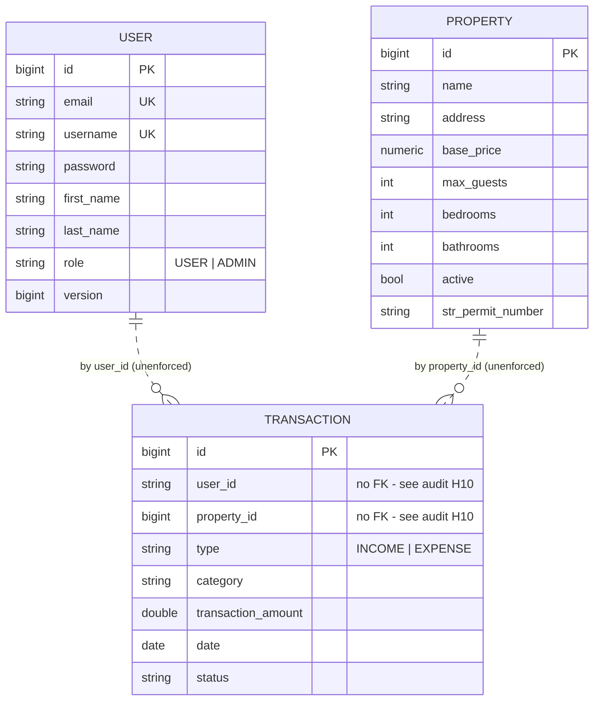

# PropFlow API

A REST API for managing short-term rental properties and their financial transactions — properties, income and expense records, tax categorisation, and recurring charges.

> **Status: portfolio project, actively being hardened.**
>
> This repository is mid-way through a documented engineering review. A full audit of its original weaknesses is published in [`docs/ENGINEERING_AUDIT.md`](docs/ENGINEERING_AUDIT.md), and the remediation plan is in [`docs/PORTFOLIO_HARDENING_PLAN.md`](docs/PORTFOLIO_HARDENING_PLAN.md).
>
> This README documents only what the code actually does today; capabilities are added here as they land.

---

## Tech Stack

- Java 17
- Spring Boot 3.4.0
- Spring Security 6 with stateless JWT bearer authentication
- Spring Data JPA / Hibernate 6
- PostgreSQL 15
- Maven (wrapper included)
- Docker / Docker Compose
- Lombok

---

## Domain Model



The dashed relationships are deliberate in this diagram: `Transaction` currently references users and properties by bare scalar columns with **no foreign key constraints**. This is a known defect (audit finding **H10**), not a design decision, and is scheduled for correction.

A `Booking` entity and table also exist, with a proper foreign key to `properties`, but no API is exposed for it yet. The unused `Expense` and `CleaningChecklist` entities were removed — `Expense` duplicated `Transaction`, and neither had any endpoint.

---

## API

Base URL: `http://localhost:8080`

Every endpoint requires a bearer token except `POST /api/auth/signup`, `POST /api/auth/signin`, and the OpenAPI paths. Unauthenticated requests receive `401`; authenticated requests lacking the required role receive `403`. Both are RFC 7807 `application/problem+json`.

```bash
TOKEN=$(curl -s -X POST http://localhost:8080/api/auth/signin \
  -H 'Content-Type: application/json' \
  -d '{"username":"you","password":"your-password"}' | jq -r .accessToken)

curl http://localhost:8080/api/properties -H "Authorization: Bearer $TOKEN"
```

### Authentication (public)
| Method | Path | Notes |
|---|---|---|
| `POST` | `/api/auth/signup` | Creates a user; BCrypt-hashed password; returns `201` and never returns credentials |
| `POST` | `/api/auth/signin` | Returns a signed JWT, its type, its lifetime, and the user |

### Properties
| Method | Path | Success | Notes |
|---|---|---|---|
| `GET` | `/api/properties` | `200` | Paged: `?page=&size=&sort=`. Default size 20, max 100. |
| `GET` | `/api/properties/{id}` | `200` | `404` if unknown |
| `POST` | `/api/properties` | `201` | Validated; returns `Location` |
| `PUT` | `/api/properties/{id}` | `200` | Validated; full replacement |
| `DELETE` | `/api/properties/{id}` | `204` | `404` if unknown |

Paged responses use a stable envelope rather than Spring's `PageImpl`:

```json
{ "content": [ ... ], "page": 0, "size": 20, "totalElements": 42, "totalPages": 3, "last": false }
```

### Transactions
| Method | Path |
|---|---|
| `GET` | `/api/transactions` |
| `GET` | `/api/transactions/{id}` |
| `GET` | `/api/transactions/user/{userId}` |
| `GET` | `/api/transactions/property/{propertyId}` |
| `POST` | `/api/transactions` |
| `PUT` | `/api/transactions/{id}` |
| `DELETE` | `/api/transactions/{id}` |
| `POST` | `/api/transactions/search` | ⚠️ Filters are currently ignored — see audit **H2** |

### Users
| Method | Path | Required role |
|---|---|---|
| `GET` | `/api/users/me` | any authenticated user |
| `GET` | `/api/users` | `ADMIN` |
| `GET` | `/api/users/{id}` | `ADMIN` |
| `DELETE` | `/api/users/{id}` | `ADMIN` |

`POST /api/users` and `PUT /api/users/{id}` were **removed**. The first persisted passwords without hashing and duplicated signup; the second bound the JPA entity directly and saved it under the path's id with no ownership check, so any caller could rewrite any account's credentials. Safe replacements arrive with the DTO work.

A Postman collection covering the auth and user endpoints is at [`src/main/resources/postman.json`](src/main/resources/postman.json).

---

## Local Development

### Prerequisites
- JDK 17+
- Docker (for PostgreSQL)

### 1. Clone and configure

```bash
git clone https://github.com/HoseaCodes/PropFlow-API.git
cd PropFlow-API
cp .env.example .env
```

`.env.example` contains placeholders only. The defaults point at the Docker Compose database and are throwaway local values, not secrets. If port 5432 is already in use on your machine, set `DB_HOST_PORT` in `.env` and update the port in `DB_URL` to match.

### 2. Start PostgreSQL

```bash
docker compose up -d db
```

> If you change `POSTGRES_USER` / `POSTGRES_PASSWORD` after the volume already exists, PostgreSQL will ignore them — those variables only apply when it initialises an empty data directory. Reset with `docker compose down -v`, which **deletes the local database volume**.

### 3. Run the application

```bash
./mvnw spring-boot:run
```

The API listens on `http://localhost:8080`.

Flyway applies the migrations in [`src/main/resources/db/migration`](src/main/resources/db/migration) automatically at startup, in version order. Hibernate runs with `ddl-auto=validate`: it verifies that the entity mappings match the migrated schema and refuses to start if they have drifted, but never modifies the schema itself.

### 4. Run the tests

```bash
./mvnw test      # unit tests only — fast, no Docker required
./mvnw verify    # unit + integration tests — starts a PostgreSQL container
```

Tests are split into two tiers:

| Tier | Naming | Runner | What it covers |
|---|---|---|---|
| **Unit** | `*Test` | Surefire (`mvn test`) | Pure logic — no Spring context, no database. Runs in well under a second. |
| **Integration** | `*IT` | Failsafe (`mvn verify`) | Full stack: HTTP → controller → service → repository → real PostgreSQL. |

Integration tests run against **PostgreSQL in Docker via Testcontainers**, not an in-memory database. An in-memory database in "PostgreSQL compatibility mode" is not PostgreSQL — it diverges on type coercion, constraint semantics, sequences, `NUMERIC` precision, and SQL dialect — so a test that passes against it is not evidence about the database this application actually deploys on.

The container is started once per JVM and shared across all integration test classes, and Flyway migrates the fresh database on first startup. Every run is therefore continuous proof that the migrations apply cleanly from nothing.

You do **not** need `docker compose up -d db` to run the tests; Testcontainers manages its own database. Only Docker itself is required.

### Full stack in Docker

```bash
docker compose up --build
```

Also starts [Adminer](http://localhost:8082) for browsing the database.

---

## Configuration

All configuration is supplied by environment variables. See [`.env.example`](.env.example).

| Variable | Default | Purpose |
|---|---|---|
| `DB_URL` | `jdbc:postgresql://localhost:5432/propflow` | JDBC URL |
| `DB_USERNAME` | `propflow` | Database user |
| `DB_PASSWORD` | `propflow` | Database password |
| `DB_HOST_PORT` | `5432` | Host port for the Compose database |
| `JWT_SECRET` | **none — required** | HMAC signing key. The application refuses to start without it. Generate with `openssl rand -base64 48`. |
| `JWT_EXPIRATION` | `1h` | Token lifetime |
| `CORS_ALLOWED_ORIGINS` | `http://localhost:4200,https://prop-flow-ui.vercel.app` | Allowed browser origins; `*` is rejected |
| `SPRING_PROFILES_ACTIVE` | `dev` | Active profile |
| `PORT` | `8080` | HTTP port |

No credential is stored in a tracked file. The database defaults above are non-secret values for a local throwaway container. `JWT_SECRET` has **no default at all**: a fallback signing key would let anyone with the source forge a token for any account, so the application fails to start with an actionable message instead.

---

## Known Limitations

Stated plainly, because the repository is a work in progress and unverified claims are worse than none. Full detail with file references is in [`docs/ENGINEERING_AUDIT.md`](docs/ENGINEERING_AUDIT.md).

- **No per-row ownership checks yet.** Any authenticated user can read and modify *any* property or transaction. Roles are enforced; resource ownership is not. This is the next piece of work and is the most important remaining gap.
- **Tokens cannot be revoked before they expire.** This is inherent to stateless JWT. Mitigated by a one-hour default lifetime and by reloading the user from the database on every request, so a deleted account stops authenticating immediately.
- **No refresh-token flow.** Clients re-authenticate when the token expires.
- **No rate limiting** on the sign-in endpoint.
- **Transaction payloads are still JPA entities**, so those endpoints remain unvalidated and accept any field the entity exposes. Auth and property endpoints use validated DTOs.
- **Transaction search ignores its filters.**
- **No CI**, no health endpoint, no metrics.
- **Test coverage is partial.** Properties and the schema are covered end to end; transactions, users, and auth are not yet.
- **OpenAPI/Swagger does not work** — the declared springdoc version targets Spring Boot 2.

This project is **not production-ready** and is not deployed anywhere serving real users.

---

## Roadmap

Tracked in [`docs/PORTFOLIO_HARDENING_PLAN.md`](docs/PORTFOLIO_HARDENING_PLAN.md):

1. ~~Flyway schema migrations~~ *(done)*
2. ~~Testcontainers-backed integration tests against real PostgreSQL~~ *(done)*
3. ~~JWT authentication and role-based access control~~ *(done)*
4. Per-user resource ownership and authorization
5. Request/response DTOs and validation across the remaining endpoints
6. Foreign keys, targeted indexes, and `BigDecimal` money
7. Actuator health endpoints, working Docker Compose, GitHub Actions CI

---

## License

[MIT](LICENSE)
