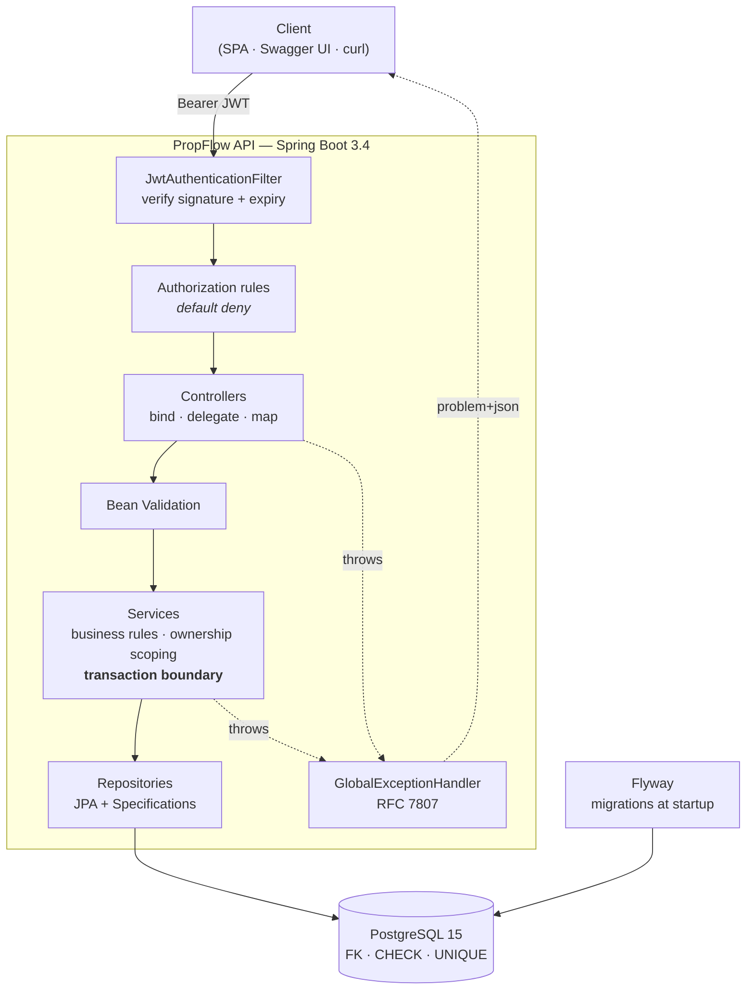
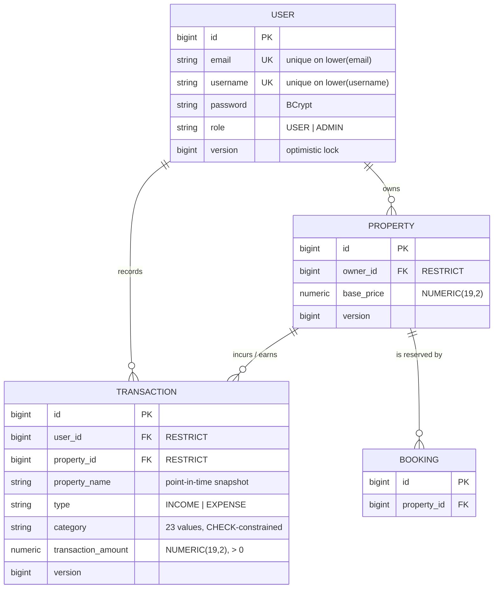

# PropFlow API

[](https://github.com/HoseaCodes/PropFlow-API/actions/workflows/ci.yml)
[](https://openjdk.org/projects/jdk/17/)
[](https://spring.io/projects/spring-boot)
[](https://www.postgresql.org/)
[](https://hoseacodes.github.io/PropFlow-API/)
[](LICENSE)

📖 **[Documentation site](https://hoseacodes.github.io/PropFlow-API/)** · **[API reference](https://hoseacodes.github.io/PropFlow-API/api/)**

A REST API for managing short-term rental properties and their financial ledger — properties, income and expense transactions, tax categorisation, refunds, and recurring charges.

Built as a **portfolio project**, deliberately taken past "it works" into the territory that actually matters in production: authorization that fails closed, schema owned by reviewable migrations, tests against a real database, errors that leak nothing, and honest documentation of what is still missing.

```bash
git clone https://github.com/HoseaCodes/PropFlow-API.git && cd PropFlow-API
cp .env.example .env && ./mvnw verify     # 187 tests. Only a JDK and Docker required.
```

> **Status: not production-ready, and not deployed.** It serves no real users and carries no real data. Every claim below is implemented and covered by tests; the [Known Limitations](#known-limitations) section is where the gaps are, and it is not boilerplate.

---

## What it demonstrates

| | |
|---|---|
| **Spring Boot REST API** | Layered architecture with enforced boundaries; controllers stay thin |
| **Spring Security 6** | Stateless JWT, default-deny filter chain, roles **and** row-level ownership |
| **Authorization that fails closed** | Ownership enforced *inside the query*, not checked after loading |
| **PostgreSQL modelling** | Real foreign keys, `CHECK` constraints, functional unique indexes, `ON DELETE RESTRICT` |
| **Migrations** | 7 Flyway migrations; `ddl-auto=validate`; migrations that refuse to destroy data |
| **Query performance** | Composite indexes chosen from actual access patterns; N+1 removed and pinned by a query-count test |
| **Integration testing** | Testcontainers against real PostgreSQL — 187 tests, 92% line coverage, no mocked repositories |
| **API design** | Request/response DTOs, Bean Validation, RFC 7807 errors, pagination, correct status codes |
| **Observability** | Actuator health with separated liveness/readiness, Prometheus metrics |
| **Docker & CI** | Non-root JRE image, working Compose stack, GitHub Actions running the full suite |
| **Engineering process** | A published [audit](docs/ENGINEERING_AUDIT.md) of this repository's own defects, and the [plan](docs/PORTFOLIO_HARDENING_PLAN.md) that fixed them |

**This repository began as a prototype with serious defects** — an entirely unauthenticated API, a committed database password, plaintext passwords on one code path, and a README advertising JWT authentication that did not exist. Rather than quietly fixing them, the audit that found them is published, and the git history shows each fix with its reasoning. That process is the point as much as the result.

---

## Architecture



Five independent layers of defence: authentication, role authorization, input validation, ownership scoping, and database constraints. Each catches what the one before it cannot — the database being the only layer that binds a writer bypassing the application.

Detail: [`docs/ARCHITECTURE.md`](docs/ARCHITECTURE.md).

---

## Domain model



Every relationship is a real foreign key with `ON DELETE RESTRICT`. Deleting a user who owns properties, or a property with transactions, is refused by the database — financial history does not disappear as a side effect. The API surfaces that as `409`.

`property_name` is denormalised deliberately: a financial record shows the name in force when it was written, so renaming a property does not rewrite past statements.

---

## Security

**Authentication** — stateless JWT (HS256). `JWT_SECRET` has no default and the application *refuses to start without it*; a default signing key is a forgery oracle. Passwords are BCrypt-hashed in exactly one code path, because a control enforced at a call site eventually gets bypassed at another — which is precisely what happened here.

**Authorization** — two layers. Roles (`USER`/`ADMIN`) decide what kind of account you are; **ownership** decides which rows you may touch. Ownership is expressed in the query:

```java
propertyRepository.findByIdAndOwner(id, caller)
Specification.allOf(scopedTo(caller), hasId(id))
```

A check performed *after* loading protects only the call sites that remember it. A scoped query **fails closed** — forget it and you get an empty result, not a breach.

Another user's resource returns **404, not 403**. A 403 confirms the id exists and lets an attacker enumerate.

Detail, including a disclosed credential-leak incident and the full limitations list: [`docs/SECURITY.md`](docs/SECURITY.md).

---

## Testing strategy

**187 tests** (77 unit, 110 integration), two tiers, with coverage measured across both and merged:

| Metric | Covered |
|---|---|
| Lines | **92.2%** |
| Instructions | **92.3%** |
| Branches | **77.0%** |

Reproduce with `./mvnw verify`, then open `target/site/jacoco/index.html`. CI prints the same table into every run summary, so the figure can never go stale the way a hardcoded badge does.

DTOs, config classes, and the entry point are excluded — their accessors are compiler-generated, and counting them inflates the number without describing tested behaviour. There is deliberately **no build-failing coverage threshold**: a gate reliably produces tests written to satisfy the gate. Branch coverage at 77% is the honest weak spot, and it is the number worth watching.

```bash
./mvnw test      # unit only — no Docker, well under a second
./mvnw verify    # + integration against real PostgreSQL
```

| Tier | Runner | Covers |
|---|---|---|
| Unit (`*Test`) | Surefire | JWT signing/verification, income-expense category rules |
| Integration (`*IT`) | Failsafe | HTTP → controller → service → repository → **real PostgreSQL** |

Integration tests use **Testcontainers, not H2**. An in-memory database in "PostgreSQL compatibility mode" is not PostgreSQL — it diverges on type coercion, constraint semantics, sequences and `NUMERIC` precision, so a passing test would not be evidence about the deployed database. Several tests assert PostgreSQL behaviour directly: functional-index uniqueness, `ON DELETE RESTRICT`, `NUMERIC` arithmetic, and index column order read from `pg_indexes`.

The container starts once per JVM and is shared, so the first integration class pays ~10s and the next runs in **0.097s**.

What the suite proves, beyond "the endpoints respond":

- **One user cannot reach another's data** by read, list, search, update, delete, or by writing against their property
- **The database enforces its own invariants** — asserted with raw SQL that bypasses the application entirely
- **Money is exact** — `0.10 + 0.20` summed by PostgreSQL equals `0.30`
- **A 5-row page issues ≤ 2 queries** — an N+1 is invisible in a response body, so it is measured via Hibernate statistics
- **Search filters actually filter** — the regression test for a bug where a fully-built `Specification` was silently discarded

---

## Reliability & operations

| Concern | Approach |
|---|---|
| Database outage | Fails **readiness**, not liveness — traffic stops routing, processes stay alive. Restarting cannot fix a database, and restarting the fleet causes a cold-start stampede on recovery. |
| Concurrent updates | Optimistic locking (`@Version`) on all three mutable entities → `409`, not a silent lost update |
| Duplicate registration | Application check for a friendly message; a **functional unique index** is the actual guarantee, since check-then-act is racy |
| Accidental deletion | `ON DELETE RESTRICT` → `409` rather than orphaned financial records |
| Bad migration | Flyway aborts, `ddl-auto=validate` refuses to start on drift, naming the exact column |
| Error leakage | RFC 7807 with a correlation id; stack traces and SQL stay in the log |

Health, metrics, failure modes, what breaks first under load, and what a real deployment would add: [`docs/OPERATIONS.md`](docs/OPERATIONS.md).

---

## Local development

**Prerequisites:** JDK 17+, Docker.

```bash
git clone https://github.com/HoseaCodes/PropFlow-API.git
cd PropFlow-API
cp .env.example .env
openssl rand -base64 48          # paste into JWT_SECRET in .env

docker compose up -d db          # PostgreSQL only — run the app from your IDE
./mvnw spring-boot:run

# or the whole stack
docker compose up --build
```

The API listens on <http://localhost:8080>. Flyway applies migrations at startup.

Tests need **no running database** — Testcontainers manages its own.

<details>
<summary>Configuration reference</summary>

| Variable | Default | Purpose |
|---|---|---|
| `JWT_SECRET` | **none — startup fails** | HMAC signing key. `openssl rand -base64 48` |
| `JWT_EXPIRATION` | `1h` | Token lifetime |
| `DB_URL` | `jdbc:postgresql://localhost:5432/propflow` | JDBC URL |
| `DB_USERNAME` / `DB_PASSWORD` | `propflow` | Local container credentials — not secrets |
| `DB_HOST_PORT` | `5432` | Change if a local PostgreSQL already owns it |
| `ADMINER_HOST_PORT` | `8082` | Adminer UI |
| `CORS_ALLOWED_ORIGINS` | `http://localhost:4200` | `*` is rejected at startup |
| `SPRING_PROFILES_ACTIVE` | `dev` | Active profile |
| `PORT` | `8080` | HTTP port |

No credential is stored in any tracked file.

**Gotcha:** PostgreSQL ignores `POSTGRES_USER`/`POSTGRES_PASSWORD` when the data volume already exists — they only apply on first initialisation. Reset with `docker compose down -v` (**deletes the volume**).
</details>

---

## API documentation

With the application running:

| | |
|---|---|
| **Swagger UI** | <http://localhost:8080/swagger-ui.html> |
| **OpenAPI JSON** | <http://localhost:8080/v3/api-docs> |

Generated from the controllers and validation constraints, so it cannot drift from the code — which is why endpoints are not re-listed at length here. Sign in via `POST /api/auth/signin`, click **Authorize**, paste the `accessToken`, and every protected endpoint is callable from the browser.

```bash
TOKEN=$(curl -s -X POST http://localhost:8080/api/auth/signin \
  -H 'Content-Type: application/json' \
  -d '{"username":"you","password":"your-password"}' | jq -r .accessToken)

curl http://localhost:8080/api/properties -H "Authorization: Bearer $TOKEN"
```

**Resources:** `/api/auth` (public), `/api/properties`, `/api/transactions`, `/api/users` (mostly `ADMIN`), `/actuator/health` (public).

**Errors** are RFC 7807 `application/problem+json`: `400` invalid field (with per-field `errors`), `401` no token, `403` wrong role, `404` missing *or not yours*, `409` conflict, `422` valid fields in an invalid combination.

---

## Engineering decisions

Six decisions where a competent engineer could reasonably have chosen otherwise. Each [ADR](docs/adr/) states its downsides — one that lists none is marketing.

**[PostgreSQL over MongoDB](docs/adr/ADR-001-postgresql.md)** — the invariants here are relational. A document store can only enforce "every transaction references a real property" advisorily, in application code. This project has already lived that failure: transactions referenced users through an unvalidated `VARCHAR` and the model drifted.

**[JWT, with the revocation problem stated plainly](docs/adr/ADR-002-jwt-authentication.md)** — stateless tokens cannot be revoked before expiry. The mitigation implemented is a per-request principal reload, so a deleted account stops working immediately; it costs a query per request and gives up some statelessness. A denylist would work but would mean the original choice was wrong.

**[Flyway over `ddl-auto=update`](docs/adr/ADR-003-flyway-migrations.md)** — auto-DDL only ever *adds*, produces nothing reviewable in a PR, and yields a schema that depends on deploy history rather than current code. The `V1` baseline deliberately preserves the model's known defects so the fixes land as real, reviewable migrations.

**[Testcontainers over H2](docs/adr/ADR-004-testcontainers.md)** — four existing tests would be meaningless against an in-memory substitute. The cost is a hard Docker dependency and seconds instead of milliseconds.

**[One deployable, not microservices](docs/adr/ADR-005-modular-monolith.md)** — one bounded context, one team, one transactional model. Splitting would trade ACID for eventual consistency *in a financial ledger*. Also records why Kafka, Redis, Kubernetes, CQRS, and OpenTelemetry were each rejected, and which constraints would change the answer.

**[`BigDecimal`/`NUMERIC` for money](docs/adr/ADR-006-numeric-money.md)** — `0.1 + 0.2 == 0.30000000000000004`. Invisible per row; not invisible in a year's tax total.

---

## Known limitations

Stated plainly. Finding these undisclosed would be worse than reading them here.

- **Tokens cannot be revoked before expiry** — inherent to stateless JWT. One-hour lifetime; deleted accounts stop working immediately via the per-request reload.
- **No rate limiting on sign-in.** Credential stuffing is unmitigated, and BCrypt's cost makes a flood a CPU denial-of-service vector. The most significant gap.
- **No refresh tokens**, no password reset, no MFA, no email verification.
- **`POST` is not idempotent.** Retrying `POST /api/transactions` after a timeout creates a duplicate. For a ledger this is a genuine gap; the fix is an `Idempotency-Key` header.
- **No audit log.** Financial mutations are protected by constraints but there is no immutable record of who changed what.
- **Timestamps use `java.util.Date`** rather than `java.time` — mutable and timezone-blind.
- **Free-text search is a sequential scan.** `LIKE '%term%'` cannot use a B-tree index. Upgrade path: `tsvector` + GIN.
- **No `Booking` API.** Table and entity exist; date-overlap prevention is not implemented.
- **No load testing.** No throughput or latency numbers are claimed anywhere in this repository.
- **No dependency scanning or penetration testing.**

---

## Future improvements

Ranked by value, not effort:

1. **Rate limiting and lockout** on authentication
2. **`Booking` with a PostgreSQL exclusion constraint** (`EXCLUDE USING gist`) preventing double-booking *at the database level* — an invariant that survives concurrent requests, which application-level checking cannot guarantee
3. **Refresh-token flow**, enabling access-token lifetimes in minutes
4. **Append-only audit log** for financial mutations
5. **`java.time` migration** and idempotency keys
6. **Dependency and container scanning** in CI

---

## Documentation

| | |
|---|---|
| [`docs/ARCHITECTURE.md`](docs/ARCHITECTURE.md) | Layers, boundaries, data and transaction model, deployment |
| [`docs/SECURITY.md`](docs/SECURITY.md) | Auth model, secret management, disclosed incident, limitations |
| [`docs/OPERATIONS.md`](docs/OPERATIONS.md) | Health, metrics, failure modes, troubleshooting, what breaks first |
| [`docs/adr/`](docs/adr/) | Six architecture decision records |
| [`docs/ENGINEERING_AUDIT.md`](docs/ENGINEERING_AUDIT.md) | The original audit — 37 findings that started this work |
| [`docs/PORTFOLIO_HARDENING_PLAN.md`](docs/PORTFOLIO_HARDENING_PLAN.md) | The prioritised remediation plan |
| [`AGENTS.md`](AGENTS.md) | Repository rules for AI coding agents, each citing the defect that motivated it |

All of the above is also published as a [documentation site](https://hoseacodes.github.io/PropFlow-API/) with a browsable [API reference](https://hoseacodes.github.io/PropFlow-API/api/), built by [`.github/workflows/docs.yml`](.github/workflows/docs.yml). The OpenAPI spec is generated from the running application during the build and validated before publishing, so it cannot drift from the code.

---

## License

[MIT](LICENSE)
