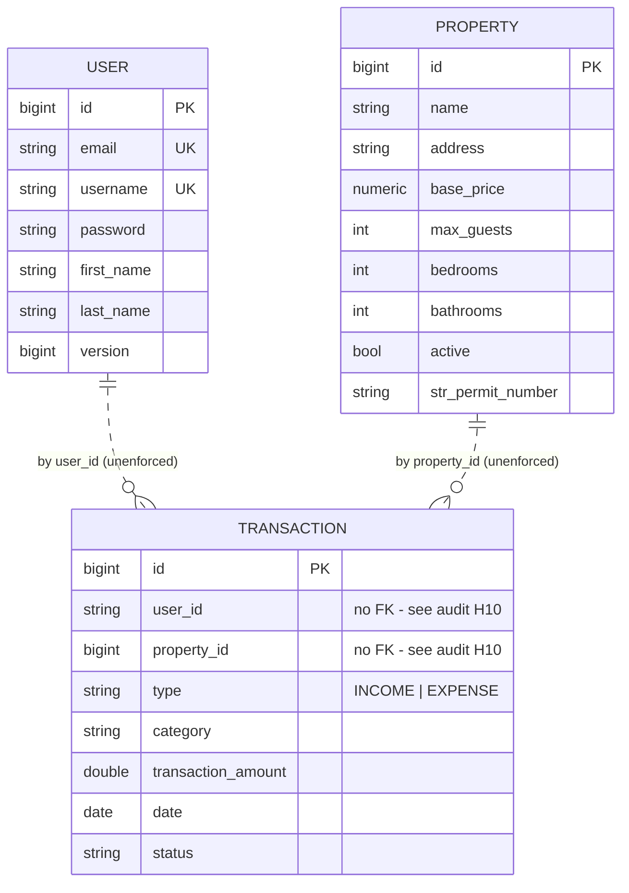

# PropFlow API

A REST API for managing short-term rental properties and their financial transactions — properties, income and expense records, tax categorisation, and recurring charges.

> **Status: portfolio project, actively being hardened.**
>
> This repository is mid-way through a documented engineering review. A full audit of its current weaknesses is published in [`docs/ENGINEERING_AUDIT.md`](docs/ENGINEERING_AUDIT.md), and the remediation plan is in [`docs/PORTFOLIO_HARDENING_PLAN.md`](docs/PORTFOLIO_HARDENING_PLAN.md).
>
> **The API is currently unauthenticated** and should not be exposed to the internet. Authentication and authorization are the next items of work. This README documents only what the code actually does today; capabilities are added here as they land.

---

## Tech Stack

- Java 17
- Spring Boot 3.4.0
- Spring Security (password hashing; endpoint protection **not yet** implemented)
- Spring Data JPA / Hibernate 6
- PostgreSQL 15
- Maven (wrapper included)
- Docker / Docker Compose
- Lombok

---

## Domain Model



The dashed relationships are deliberate in this diagram: `Transaction` currently references users and properties by bare scalar columns with **no foreign key constraints**. This is a known defect (audit finding **H10**), not a design decision, and is scheduled for correction.

`Booking`, `Expense`, and `CleaningChecklist` entities also exist in the codebase but have no repository, service, or API. They are unused.

---

## API

Base URL: `http://localhost:8080`

### Authentication
| Method | Path | Notes |
|---|---|---|
| `POST` | `/api/auth/signup` | Creates a user; password is BCrypt-hashed |
| `POST` | `/api/auth/signin` | Verifies credentials. **Returns no token** — there is currently no way to authenticate a subsequent request. |

### Properties
| Method | Path |
|---|---|
| `GET` | `/api/properties` |
| `GET` | `/api/properties/{id}` |
| `POST` | `/api/properties` |
| `PUT` | `/api/properties/{id}` |
| `DELETE` | `/api/properties/{id}` |

### Transactions
| Method | Path |
|---|---|
| `GET` | `/api/transactions` |
| `GET` | `/api/transactions/{id}` |
| `GET` | `/api/transactions/user/{userId}` |
| `GET` | `/api/transactions/property/{propertyId}` |
| `POST` | `/api/transactions` |
| `PUT` | `/api/transactions/{id}` |
| `DELETE` | `/api/transactions/{id}` |
| `POST` | `/api/transactions/search` | ⚠️ Filters are currently ignored — see audit **H2** |

### Users
| Method | Path |
|---|---|
| `GET` | `/api/users` |
| `GET` | `/api/users/{id}` |
| `POST` | `/api/users` | ⚠️ Stores the password **unhashed** — see audit **C3** |
| `PUT` | `/api/users/{id}` |
| `DELETE` | `/api/users/{id}` |

A Postman collection covering the auth and user endpoints is at [`src/main/resources/postman.json`](src/main/resources/postman.json).

---

## Local Development

### Prerequisites
- JDK 17+
- Docker (for PostgreSQL)

### 1. Clone and configure

```bash
git clone https://github.com/HoseaCodes/PropFlow-API.git
cd PropFlow-API
cp .env.example .env
```

`.env.example` contains placeholders only. The defaults point at the Docker Compose database and are throwaway local values, not secrets. If port 5432 is already in use on your machine, set `DB_HOST_PORT` in `.env` and update the port in `DB_URL` to match.

### 2. Start PostgreSQL

```bash
docker compose up -d db
```

> If you change `POSTGRES_USER` / `POSTGRES_PASSWORD` after the volume already exists, PostgreSQL will ignore them — those variables only apply when it initialises an empty data directory. Reset with `docker compose down -v`, which **deletes the local database volume**.

### 3. Run the application

```bash
./mvnw spring-boot:run
```

The API listens on `http://localhost:8080`. Schema is currently created by Hibernate `ddl-auto=update` (a known weakness — audit **H4**; Flyway migrations are planned).

### 4. Run the tests

```bash
docker compose up -d db   # required: the current test starts a full Spring context
./mvnw test
```

**The test suite is currently one `contextLoads()` test and requires a running database.** It verifies that Spring can wire the application; it does not verify any behaviour. Replacing this with meaningful unit, API, and Testcontainers-backed integration tests is the highest-priority work after authentication.

### Full stack in Docker

```bash
docker compose up --build
```

Also starts [Adminer](http://localhost:8082) for browsing the database.

---

## Configuration

All configuration is supplied by environment variables. See [`.env.example`](.env.example).

| Variable | Default | Purpose |
|---|---|---|
| `DB_URL` | `jdbc:postgresql://localhost:5432/propflow` | JDBC URL |
| `DB_USERNAME` | `propflow` | Database user |
| `DB_PASSWORD` | `propflow` | Database password |
| `DB_HOST_PORT` | `5432` | Host port for the Compose database |
| `SPRING_PROFILES_ACTIVE` | `dev` | Active profile |
| `PORT` | `8080` | HTTP port |

No credential is stored in a tracked file. The defaults above are non-secret values for a local throwaway container.

---

## Known Limitations

Stated plainly, because the repository is a work in progress and unverified claims are worse than none. Full detail with file references is in [`docs/ENGINEERING_AUDIT.md`](docs/ENGINEERING_AUDIT.md).

- **No authentication or authorization.** Every endpoint is publicly reachable.
- **No JWT.** Sign-in verifies credentials but issues nothing the client can present.
- **`POST /api/users` stores passwords in plaintext**, bypassing the hashing used by `/api/auth/signup`.
- **API responses include the password hash**, because JPA entities are returned directly.
- **No input validation.** No request body is validated.
- **No database migrations.** Schema comes from Hibernate auto-DDL.
- **Transaction search ignores its filters.**
- **No meaningful tests**, no CI, no health endpoint, no metrics.
- **OpenAPI/Swagger does not work** — the declared springdoc version targets Spring Boot 2.

This project is **not production-ready** and is not deployed anywhere serving real users.

---

## Roadmap

Tracked in [`docs/PORTFOLIO_HARDENING_PLAN.md`](docs/PORTFOLIO_HARDENING_PLAN.md):

1. JWT authentication and per-user resource authorization
2. Testcontainers-backed integration tests against real PostgreSQL
3. Flyway schema migrations, foreign keys, and targeted indexes
4. Request/response DTOs, validation, and an RFC 7807 error model
5. Actuator health endpoints, working Docker Compose, GitHub Actions CI

---

## License

[MIT](LICENSE)
