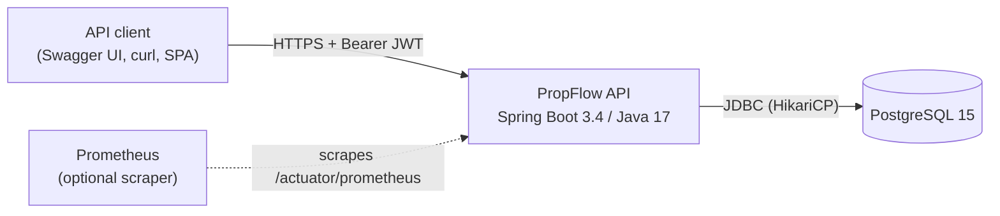
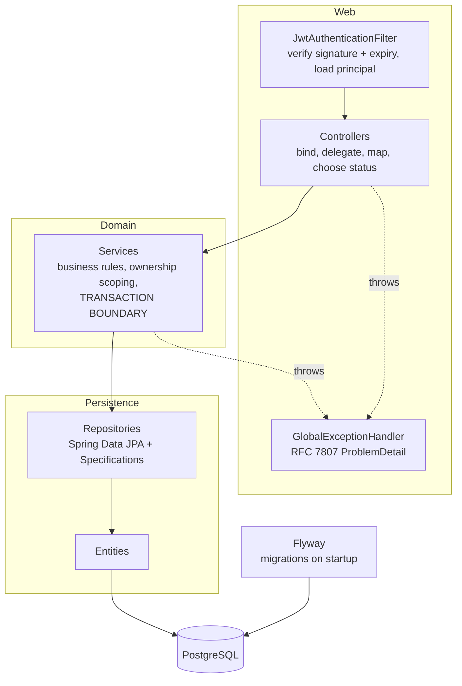
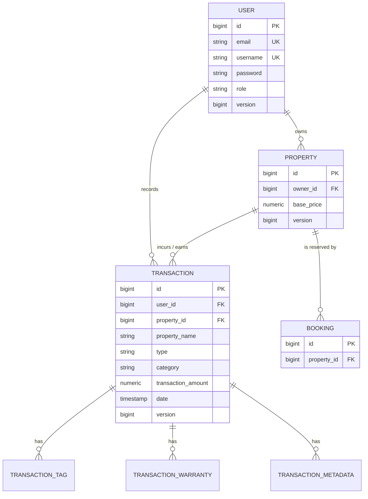
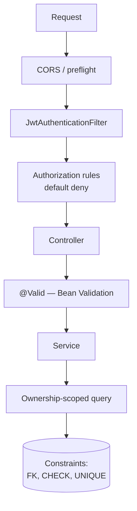
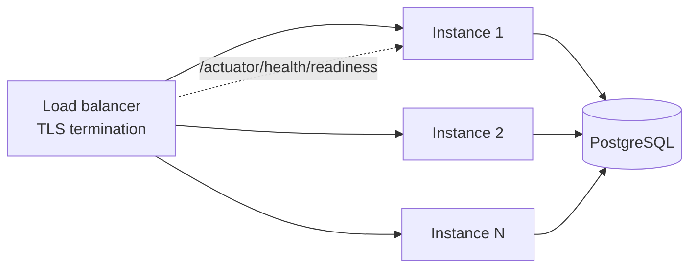

# PropFlow API — Architecture

How the system is put together and why. Companion documents:
[`SECURITY.md`](./SECURITY.md), [`OPERATIONS.md`](./OPERATIONS.md),
[`adr/`](./adr/README.md).

---

## System context

A single Spring Boot service over a single PostgreSQL database. There are no
external service dependencies — no payment provider, no email gateway, no
message broker.

That the box diagram is this small is the point. One bounded context, one team,
one database. Splitting it would buy network partitions and distributed
transactions in exchange for nothing — see
[ADR-005](./adr/ADR-005-modular-monolith.md).

---

## Application layers

| Package | Responsibility | Must not |
|---|---|---|
| `config` | Security chain, CORS, OpenAPI | contain business logic |
| `security` | JWT minting/validation, principal loading | reach into services |
| `controller` | HTTP binding, status codes | contain business logic or touch repositories |
| `dto/request` | Accepted shapes + Bean Validation | expose entity internals |
| `dto/response` | Returned shapes | expose credentials or internal fields |
| `service` | Business rules, authorization scoping, transactions | know about HTTP |
| `repository` | Data access, `Specification` factories | contain business rules |
| `model` | JPA entities | be returned from a controller |
| `exception` | Typed exceptions + handler | leak internals to clients |

### Rules that are load-bearing

**Controllers never touch repositories.** The transaction boundary is at the
service, so a controller reaching past it would execute outside any transaction.

**Entities never cross the HTTP boundary.** In either direction. This is not
style — it is what prevents credential leakage (`User` must expose
`getPassword()` to satisfy `UserDetails`) and mass assignment (an entity has no
notion of which fields a client may set).

**Services return DTOs, not entities.** With `spring.jpa.open-in-view=false` the
persistence context closes when the service method returns, so anything the
response needs must be materialised before that boundary. Mapping inside the
service makes that explicit; mapping in the controller fails at runtime the
moment a lazy field is touched. The cost — services knowing about response types
— is accepted deliberately.

**Authorization is expressed in the query, not checked after loading.** A check
after the fact protects only the call sites that remember it. A scoped query
fails closed.

---

## Domain model

**`User`** — account and Spring Security principal. Role is `USER` or `ADMIN`.

**`Property`** — a rental unit, owned by exactly one user. Ownership is the
backbone of authorization.

**`Transaction`** — an income or expense record against a property. The richest
entity: category taxonomy, embedded tax details and refund info, element
collections for tags, warranties, and arbitrary metadata.

**`Booking`** — a reservation. Table and entity exist; no API yet.

### Modelling decisions worth defending

**`property_name` is denormalised onto `Transaction` on purpose.** A financial
record should display the name in force when it was written, so renaming a
property does not rewrite history on past statements. It is a point-in-time
snapshot, not a cache, and is never refreshed.

**Embedded value objects, not entities.** `TaxDetails`, `RefundInfo`, and
`Warranty` have no identity or lifecycle of their own, are always loaded with
their parent, and are never queried independently. Separate tables would add
joins for nothing.

**Money is `BigDecimal` over `NUMERIC(19,2)`.** Never `double`. See
[ADR-006](./adr/ADR-006-numeric-money.md).

**Timestamps are still `java.util.Date`** — a known wart. Mutable and
timezone-blind; migrating to `java.time` is outstanding and honestly recorded
rather than quietly ignored.

---

## API architecture

REST over JSON. Resource-oriented paths, plural nouns, HTTP verbs for
operations.

| Convention | Choice |
|---|---|
| Create | `201` + `Location` header |
| Update | `200` with the updated representation |
| Delete | `204`, no body |
| Not found / not yours | `404` |
| Validation failure | `400` with per-field `errors` |
| Domain rule violation | `422` |
| Uniqueness or concurrency conflict | `409` |
| Unauthenticated | `401` |
| Authenticated, wrong role | `403` |

**Errors are RFC 7807 `application/problem+json`,** uniformly — including
failures raised inside security filters, which sit outside
`@RestControllerAdvice` and would otherwise return a container error page.
Unexpected failures carry a `correlationId` matching the server log; stack
traces and SQL never reach a client.

**Collections are always paginated,** returned in a `PagedResponse` envelope
rather than Spring's `PageImpl`, whose JSON shape is an accident of its
internals. Page size is capped server-side so `?size=1000000` cannot undo it.

**One deliberate REST deviation:** `POST /api/transactions/search`. Sixteen
optional criteria including free text and date ranges do not encode comfortably
as query parameters and risk proxy URL limits. The cost — not cacheable, not
bookmarkable — is acceptable for an authenticated, highly variable report query.

---

## Data architecture

**Schema is owned by Flyway.** Seven ordered, checksummed migrations in
`src/main/resources/db/migration`. Hibernate runs `ddl-auto=validate` and never
modifies the schema; entity/schema drift is a startup failure naming the exact
column. See [ADR-003](./adr/ADR-003-flyway-migrations.md).

| Migration | Change |
|---|---|
| `V1` | Baseline schema |
| `V2` | User role |
| `V3` | Case-insensitive unique indexes on `lower(email)` / `lower(username)` |
| `V4` | Optimistic locking on `properties` |
| `V5` | Money `DOUBLE PRECISION` → `NUMERIC(19,2)`, positive-amount check, version |
| `V6` | Property ownership FK + index |
| `V7` | Transaction FKs (`user_id` retyped `VARCHAR`→`BIGINT`), composite indexes |

### Constraints as the last line of defence

Application checks are advisory — they do not bind a repair script, a
background job, or a second writer. The database enforces:

- Foreign keys with `ON DELETE RESTRICT` on every relationship
- `CHECK` constraints for every persisted enum, and `transaction_amount > 0`
- Functional unique indexes on `lower(email)` / `lower(username)`
- `NOT NULL` on identity columns

`SchemaMigrationIT` asserts these hold by issuing raw SQL that bypasses the
application entirely.

### Indexes

Only where an access pattern justifies one. PostgreSQL does not index foreign
keys automatically.

| Index | Supports |
|---|---|
| `ix_properties_owner_id` | every property read (all are owner-scoped) |
| `ix_transactions_user_id_date (user_id, date DESC)` | owner-scoped listing, newest first |
| `ix_transactions_property_id_date` | per-property statements |
| `ix_transaction_{tags,warranties}_transaction_id` | collection loads and cascade checks |
| `ix_bookings_property_id` | booking lookups, parent delete checks |

**Column order carries the reasoning.** Every transaction read is
`WHERE user_id = ? ORDER BY date DESC`. With `user_id` leading, the planner
seeks to that user's slice; with `date DESC` second, rows in that slice are
already ordered, so the sort step disappears and a page can be read without
sorting the user's whole history. Reversed, an equality predicate on a trailing
column cannot drive a seek.

`(user_id, property_id)` is deliberately absent — the leading column already
narrows to the user.

**Tradeoff:** every index costs storage and is maintained inside each write.
Justified for a read-heavy reporting workload; that judgement should be re-made,
not assumed, for a write-heavy table.

### Transaction model

Boundaries are at the **service method** — the unit of work corresponding to one
business operation.

- A repository call is too small: a read-then-write would span two transactions
  and lose a concurrent update.
- A controller is the wrong layer: transaction scope would be tied to HTTP.

Classes default to `@Transactional(readOnly = true)`; writes override. `readOnly`
is not documentation — it lets Hibernate skip dirty-checking and signals intent
to the driver.

Isolation is `READ_COMMITTED` (the PostgreSQL default). Lost updates are
prevented by **optimistic locking** (`@Version` on `User`, `Property`,
`Transaction`) rather than by raising isolation: no locks are held, readers are
never blocked, and conflicts surface as `409` telling the client to re-read.
That is the right trade when conflicts are rare, which they are when each user
edits their own records.

---

## Security boundaries

Five layers, each catching what the previous cannot:

1. **Authentication** — signature, expiry, and subject verified per request; the principal reloaded from the database.
2. **Role authorization** — default deny; a new endpoint is protected unless deliberately opened.
3. **Input validation** — request records constrain both shape and values. Fields absent from a record cannot be set at all.
4. **Ownership scoping** — applied inside the query, so a forgotten scope yields an empty result rather than a leak.
5. **Database constraints** — the only layer that binds writers who bypass the application.

Full detail in [`SECURITY.md`](./SECURITY.md).

---

## Major dependencies

| Dependency | Why |
|---|---|
| Spring Boot 3.4 | Framework baseline |
| Spring Security 6 | Authentication and authorization |
| Spring Data JPA / Hibernate 6 | Persistence and Criteria queries |
| PostgreSQL 15 | [ADR-001](./adr/ADR-001-postgresql.md) |
| Flyway | [ADR-003](./adr/ADR-003-flyway-migrations.md) |
| JJWT 0.12 | [ADR-002](./adr/ADR-002-jwt-authentication.md) |
| Testcontainers | [ADR-004](./adr/ADR-004-testcontainers.md) |
| Actuator + Micrometer | Health probes and metrics |
| springdoc-openapi 2.x | Generated API documentation |
| Lombok | `@Getter`/`@Setter` only — **not** `@Data` on entities |

**Deliberately absent:** microservices, Kafka, Redis, Kubernetes, CQRS, event
sourcing, MapStruct, GraphQL, OpenTelemetry. Each was considered and rejected;
reasoning in [ADR-005](./adr/ADR-005-modular-monolith.md) and
[`OPERATIONS.md`](./OPERATIONS.md).

---

## Testing architecture

178 tests in two tiers.

| Tier | Naming | Runner | Needs | Covers |
|---|---|---|---|---|
| Unit | `*Test` | Surefire (`mvn test`) | nothing | Pure logic: JWT crypto, category rules |
| Integration | `*IT` | Failsafe (`mvn verify`) | Docker | HTTP → controller → service → repository → PostgreSQL |

Integration tests run against real PostgreSQL via Testcontainers, sharing one
JVM-wide container and one Spring context. Flyway migrates the fresh database
each run, so every run proves the migrations apply cleanly from nothing.

| Suite | Proves |
|---|---|
| `AuthApiIT` | Registration, sign-in, endpoint protection, role rules |
| `ResourceOwnershipIT` | One user cannot reach another's data, by any route |
| `SchemaMigrationIT` | The database enforces its own invariants |
| `TransactionApiIT` | Search filters work; money is exact; query count bounded |
| `PropertyApiIT` | CRUD, validation, pagination, status codes |
| `ActuatorIT` | Health groups, metrics access control, endpoint exposure |

---

## Deployment model

Stateless container. No session state, no sticky routing, no local caching — so
horizontal scaling is adding instances behind a load balancer.

Configuration is entirely environment-driven; `JWT_SECRET` has no default and
startup fails without it. Migrations run automatically at startup — acceptable
at this scale, though a large fleet would run Flyway as a separate pre-deploy
step so instances do not race.

**Currently deployed nowhere.** Docker Compose provides the local stack; CI
builds and verifies the image but publishes nothing. The scaling constraint is
not the application but the single database — see "what breaks first" in
[`OPERATIONS.md`](./OPERATIONS.md).
