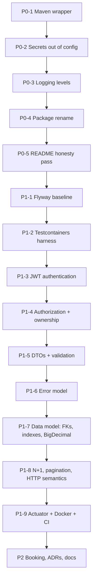

# PropFlow API — Portfolio Hardening Plan

**Created:** 2026-08-07
**Baseline commit:** `f771d7d`
**Input:** [`ENGINEERING_AUDIT.md`](./ENGINEERING_AUDIT.md) — 37 findings across CRITICAL/HIGH/MEDIUM/LOW
**Goal:** Move the repository from **prototype** to **production-oriented portfolio application** — a project that demonstrably understands authentication, migrations, testing, and operations, while being honest that it does not carry production traffic.

---

## Target Architecture

Decided up front so every task below has a fixed destination. These are deliberately conservative choices; nothing here is adopted for appearance.

| Concern | Decision | Rationale |
|---|---|---|
| Base package | `com.hoseacodes.propflow` | `com.airbnb` is Airbnb, Inc.'s namespace (audit **L2**) |
| Java | 17 (unchanged) | Stable, matches Docker base images. No reason to churn. |
| Spring Boot | 3.4.0 (unchanged) | Current. Avoid gratuitous upgrade risk. |
| Authentication | JJWT 0.12.x, HS256, stateless bearer tokens | Named role requirement. Access-token-only; revocation limits documented rather than papered over. |
| Authorization | `USER` / `ADMIN` roles + per-row ownership scoping | Roles alone are not authorization. Ownership is the real control. |
| Migrations | Flyway, `ddl-auto=validate` | Reviewable, ordered, reproducible schema (audit **H4**) |
| Testing | JUnit 5 + MockMvc + Testcontainers PostgreSQL | Test against the database you deploy on, not H2 |
| API contract | Java `record` request/response DTOs, hand-mapped | Breaks the entity/API coupling causing **C5**, **H1**, **H5** |
| Errors | RFC 7807 `ProblemDetail` | Idiomatic in Boot 3; consistent, machine-readable |
| Money | `BigDecimal` → `NUMERIC(19,2)` | Binary floats cannot represent decimal money |
| Time | `java.time` (`Instant` / `LocalDate`) | `java.util.Date` is mutable and timezone-blind |
| Observability | Actuator + Micrometer | Health groups, metrics. **No** OpenTelemetry — documented instead. |
| API docs | `springdoc-openapi-starter-webmvc-ui` 2.x | Current dependency is a Boot 2 artifact and does not work |
| CI | GitHub Actions | Compile, test (Testcontainers), package |

**Explicitly rejected:** microservices, Kafka, Kubernetes, Redis, event sourcing, CQRS, MapStruct, GraphQL. None is justified by this application's requirements, and each would make the project *less* coherent. Hand-written DTO mapping is trivial at this size and keeps boundary decisions readable.

### Package layout

```
com.hoseacodes.propflow
├── config/          SecurityConfig, CorsConfig, OpenApiConfig, JacksonConfig
├── security/        JwtService, JwtAuthenticationFilter, CustomUserDetailsService
├── controller/      REST controllers only — no business logic
├── dto/
│   ├── request/     @Valid-annotated request records
│   └── response/    response records (never entities)
├── service/         business logic, transaction boundaries
├── repository/      Spring Data JPA interfaces
├── model/           JPA entities
└── exception/       typed exceptions + GlobalExceptionHandler
```

### Domain model changes

Ownership is the backbone of authorization, so it has to exist before authorization can be enforced:

```
User 1──* Property 1──* Transaction
     └────────────────────*
```

- `Property` gains `owner` → `User` (`@ManyToOne`, FK, `NOT NULL`)
- `Transaction` gains `property` → `Property` and `user` → `User` (replacing bare scalar `propertyId`/`userId`)
- `Expense` and `CleaningChecklist` are **deleted** — `Expense` duplicates `Transaction`; neither has any API
- `Booking` is **kept** and implemented in P2 (date-overlap prevention is the best remaining reliability material)

---

## Sequencing

Dependency-ordered. Later work assumes earlier work is done.



**P0 ships first as its own set of commits.** Even if everything after it stalled, the repository would already be materially safer to share: no live credential, buildable on clone, no false claims.

**Tests are written alongside P1-3 onward, not retrofitted.** That is the point of putting the Testcontainers harness (P1-2) before the authentication work (P1-3).

---

# P0 — Must Fix

Findings that would actively damage you if an experienced engineer opened the repository today. Total effort: roughly half a day.

---

### P0-1 · Commit the Maven wrapper

**Objective.** Make `git clone && ./mvnw verify` work.

**Why it matters.** `.gitignore:132-134` excludes `mvnw`, `mvnw.cmd`, and `.mvn/`. The README instructs the reader to run `./mvnw clean package` — a command that does not exist on a fresh clone. A reviewer's very first action fails. This also blocks CI (P1-9), since the workflow needs the wrapper.

**Engineering concept.** The Maven wrapper pins the *build tool* version in the repository, so every developer and every CI runner builds with identical Maven. That is the same reproducibility argument as a lockfile. Ignoring it defeats its entire purpose.

**Files.** `.gitignore`, `mvnw`, `mvnw.cmd`, `.mvn/wrapper/maven-wrapper.properties`

**Approach.** Remove the three trailing `.gitignore` entries; `git add` the wrapper files; verify the executable bit survives.

**Tests.** None (build tooling). Verified by `./mvnw -v` from a clean checkout.

**Regression risk.** None.

**Portfolio value.** High — removes the "cannot build this" first impression.

---

### P0-2 · Remove the committed credential; drive configuration from the environment

**Objective.** No secret in any tracked file. Configuration supplied by environment variables with development-safe, obviously-non-secret defaults.

**Why it matters.** Audit **C2**. A live database password sits in `application.properties:13` in `HEAD` and across seven commits of a public repository. Committed credentials are among the first things an experienced reviewer greps for, and finding one reframes every other security claim in the project.

**Engineering concept.** *Configuration must vary per environment; code must not.* Secrets are the extreme case. The standard is externalized configuration injected at runtime — env vars locally and in containers, a secret manager in a real deployment. A development default is acceptable **only** when it is plainly not a secret (`postgres`/`postgres` against a local container). A default that looks real teaches the wrong habit and eventually ships.

**Files.** `src/main/resources/application.properties`, new `application-dev.properties`, new `.env.example`, `docker-compose.yml`

**Approach.**
1. **Rotate the PostgreSQL role password first** — this is a manual action outside the repository. Anything already public must be assumed captured.
2. Replace literals with `${DB_PASSWORD:postgres}`-style references pointed at the local Compose database.
3. Add `.env.example` containing every required key with placeholder values only (audit **L6**).
4. Make Compose inject the same variables so the containerized app can actually reach the `db` service — currently it cannot (audit **H11**).
5. Record the finding and remediation in `docs/SECURITY.md`.

**Tests.** Application starts against Compose PostgreSQL with no local `.env`. `git grep` for credential patterns returns nothing.

**Regression risk.** Low — local runs need `.env` or Compose. The README will say so.

**Portfolio value.** **Very high.** Non-negotiable before sharing the link.

> **On git history:** rotating kills the credential's value, so a `filter-repo` rewrite is optional. It breaks every existing clone and fork, and it requires a force-push. Decision: **rotate, fix forward, and disclose in `SECURITY.md`.** An audit that finds and documents its own leak is a stronger signal than a silently scrubbed history.

---

### P0-3 · Fix logging levels

**Objective.** `INFO` by default; `DEBUG` only under the `dev` profile. SQL logging off.

**Why it matters.** Audit **H8**. `logging.level.root=DEBUG` sets DEBUG for every library on the classpath. `org.springframework.security=DEBUG` logs authentication flow detail. `org.springframework.web=DEBUG` can log request headers — which is exactly where the `Authorization` header will appear once P1-3 lands. This is a sensitive-data-in-logs incident waiting to be armed.

**Engineering concept.** Log levels are a signal-to-noise control, not a verbosity dial. `DEBUG` everywhere produces volume so large that real diagnostics become unfindable, and it drags data into logs that never belonged there. `show-sql=true` is a dev toggle, not observability — real query diagnostics come from Hibernate statistics or `pg_stat_statements`, with timings.

**Files.** `src/main/resources/application.properties`, `application-dev.properties`, `PropertyController.java:38`

**Approach.** Root and application package to `INFO`. `show-sql=false`. `dev` profile overrides to `DEBUG`. Remove full-object logging of request bodies.

**Tests.** None directly; sensitive-logging assertions come with P1-3.

**Regression risk.** None.

**Portfolio value.** Medium — but it prevents a High finding later.

---

### P0-4 · Rename the base package

**Objective.** `com.airbnb` → `com.hoseacodes.propflow`. Artifact `property-management` → `propflow-api`. Main class → `PropFlowApplication`.

**Why it matters.** Audit **L2**. `com.airbnb` is Airbnb, Inc.'s reverse-DNS namespace. On a public repository presented as professional work, this reads as either a Java conventions gap or an implied affiliation with a company you do not work for. The product is called PropFlow.

**Engineering concept.** Reverse-DNS package naming exists to guarantee global uniqueness by anchoring to a domain the author controls. Using someone else's namespace defeats that and is a genuine (if low-probability) collision and trademark concern.

**Files.** Every `.java` file; `pom.xml`; `AirbnbPropertyManagementApplication.java`; `.vscode/launch.json`

**Approach.** Mechanical move. Also drop the phantom `com.airbnb.property_management` from `scanBasePackages` (audit **L4**) — with a single root package, the explicit `@EntityScan`/`@EnableJpaRepositories`/`scanBasePackages` declarations become unnecessary and can go, since Spring Boot scans downward from the main class by default.

**Isolated commit** — a wide mechanical diff must not bury substantive changes.

**Tests.** `./mvnw compile` passes; existing context test behaves as before.

**Regression risk.** Low but broad. Done before new code so later work lands in the final package.

**Portfolio value.** Medium.

---

### P0-5 · README honesty pass

**Objective.** Delete every claim the code does not support. Full rewrite deferred to P2 (Phase 13); this is triage.

**Why it matters.** Audit **L1** catalogues 13 unsupported claims: JWT authentication (does not exist), `/bookings` and `/expenses` endpoints (do not exist), Spring Boot 3.2.0 (actually 3.4.0), a `LICENSE.md` that is absent, a support email and Slack channel for a solo project, Angular frontend instructions in a backend repository, and a Docker walkthrough that cannot work. Accumulated unsupported claims are the fastest way to lose technical credibility — a careful reader will start assuming nothing in the document is true.

**Engineering concept.** A README is a contract with the reader. Its value is entirely a function of its accuracy; an inflated README is worth less than no README, because it costs the reader time and then costs you their trust.

**Files.** `README.md`, plus add `LICENSE` (MIT)

**Approach.** Strip unsupported features and phantom endpoints. Correct the version. Remove the fabricated support channels and the frontend section. Add an explicit "Status" line stating this is a portfolio project under active hardening, with a link to the audit. Claims return only as the features land.

**Tests.** Manual — every documented endpoint checked against actual `@*Mapping` annotations.

**Regression risk.** None.

**Portfolio value.** **High.** Cheap, and it stops the bleeding immediately.

---

# P1 — High-Value Improvements

The core work. This is what moves the classification and produces the evidence the role screens for.

---

### P1-1 · Flyway migrations, replacing `ddl-auto=update`

**Objective.** Version-controlled, reviewable schema. `ddl-auto=validate`.

**Why it matters.** Audit **H4**. `ddl-auto=update` only ever *adds* — it never drops a column, narrows a type, or removes a constraint. It produces no reviewable artifact, so a schema change is invisible in a pull request. The resulting schema depends on the *history of versions a database has seen*, not on current code, so environments legitimately diverge. And it cannot express data migration at all. There is already evidence of the friction: the untracked `seed.sql` holds hand-written `ALTER TABLE` and `CREATE INDEX` statements — schema changes living outside version control because no mechanism existed to hold them.

**Engineering concept.** Schema is code and belongs under the same review and versioning discipline. Flyway applies ordered, immutable, checksummed migrations and records them in `flyway_schema_history`. Pairing it with `ddl-auto=validate` means Hibernate verifies at startup that entities match the migrated schema and **fails fast on drift** — turning a class of silent production bug into a boot failure.

**Files.** `pom.xml`, `src/main/resources/db/migration/V1__initial_schema.sql`, `application.properties`

**Approach.** Generate `V1` from the current model as a baseline, then add incremental migrations for the P1-7 changes. Never edit an applied migration — the checksum is the guarantee.

**Tests.** Testcontainers integration tests run migrations on a virgin database every run, which is continuous proof that migrations apply cleanly from scratch.

**Regression risk.** **Medium — the highest of any task here.** `validate` will fail on any entity/schema mismatch. That is the feature, but the baseline must be exact. Existing local data must be reconciled or dropped deliberately.

**Portfolio value.** **Very high** — explicitly named in the role requirements.

---

### P1-2 · Testcontainers integration-test harness

**Objective.** `./mvnw verify` passes on a clean clone with only Docker required.

**Why it matters.** Audit **H3**. Today the sole test is `@SpringBootTest contextLoads()`, it requires a live PostgreSQL with the committed credentials, and **it fails** — verified by execution. So there is currently no automated evidence that anything in this application works.

**Engineering concept.** Testcontainers starts a real PostgreSQL in Docker for the test run. The alternative, H2 in PostgreSQL-compatibility mode, is faster but tests against a database you do not deploy on: it diverges on type coercion, constraint semantics, sequences, `NUMERIC` precision, upsert syntax, and JSON support. Passing tests against H2 are not evidence about PostgreSQL. The cost is Docker as a prerequisite and slower startup — mitigated by a shared singleton container across the suite.

This is also the direct answer to audit **H2**: a mocked-repository test cannot catch a discarded `Specification`, because the mock returns the stubbed list either way. Only a real database does.

**Files.** `pom.xml`, `src/test/java/.../AbstractIntegrationTest.java`, `src/test/resources/application-test.properties`

**Approach.** Singleton container pattern with `@DynamicPropertySource`. Flyway runs against it. Base class for integration tests; unit tests stay plain JUnit with no Spring context.

**Tests.** This *is* the test infrastructure. Proven by the suites that follow.

**Regression risk.** Low. Requires Docker locally and in CI (GitHub Actions runners provide it).

**Portfolio value.** **Very high** — "why Testcontainers instead of H2" is a guaranteed interview question with a crisp answer.

---

### P1-3 · Implement JWT authentication

**Objective.** Real stateless bearer-token authentication. Delete the inert code.

**Why it matters.** Audit **C4** — the most damaging finding, because it is not a bug but a *documented capability that does not exist*. Also **C1** (whole API public) and **C3** (plaintext passwords via a second signup path).

**Engineering concept.** A JWT is a signed claims token. The server validates the signature with a secret only it holds, so no server-side session lookup is needed — that is what makes it horizontally scalable, and it is the entire reason to choose it. The tradeoff is the one worth being able to state: **a stateless token cannot be revoked before it expires.** Mitigations are short expiry, a refresh-token flow, or a denylist — and a denylist reintroduces the server-side state JWT was chosen to avoid. Short expiry plus documented limitation is the honest position for this project.

Today, `AuthController.java:41-52` verifies credentials correctly and then writes the result into `SecurityContextHolder`, which is **thread-local and cleared at end of request**. Nothing is returned to the client. The authentication result is discarded microseconds after it is computed.

**Files.** `pom.xml` (JJWT), `security/JwtService.java`, `security/JwtAuthenticationFilter.java`, `config/SecurityConfig.java`, `controller/AuthController.java`, `service/UserService.java`, `model/User.java` (add `Role`)

**Approach.**
- HS256, secret from `JWT_SECRET`, **no fallback default** — the application must refuse to start without it. A default signing key is a forgery oracle.
- `OncePerRequestFilter` before `UsernamePasswordAuthenticationFilter`; validate signature **and** expiry **and** subject on every request.
- Rewrite `SecurityConfig` with the Spring Security 6 lambda DSL, `SessionCreationPolicy.STATELESS`, permitting only `/api/auth/**`, `/actuator/health`, and the OpenAPI paths.
- Consolidate all user creation into one `UserService.register(...)` that owns encoding and uniqueness — closing **C3**'s bypass at the root.
- Never log tokens.

**Tests.**
- *Unit:* token round-trip; expired token rejected; tampered signature rejected; wrong-secret token rejected.
- *API:* signin returns a token; protected endpoint without a token → 401; with a valid token → 200; with a malformed/expired token → 401; signup response contains no `password` field.
- *Integration:* full register → signin → authenticated-request flow against PostgreSQL.

**Regression risk.** **High** — this changes every endpoint from public to protected. Mitigated by writing the API tests alongside.

**Portfolio value.** **Very high** — the single highest-value change in the repository.

---

### P1-4 · Authorization and resource ownership

**Objective.** Users may only read and modify their own properties and transactions. Roles: `USER`, `ADMIN`.

**Why it matters.** Audit **C1**, **H1**, **H10**. Authentication proves *who you are*; authorization decides *what you may touch*. There is currently no ownership edge in the data model at all, so the question cannot even be asked. `PUT /api/users/{id}` (audit **H1**) lets any caller overwrite any account's credentials — mass assignment plus IDOR in four lines.

**Engineering concept.** **IDOR** — Insecure Direct Object Reference — is what you get when a resource ID from the URL is trusted without checking that the caller may access it. The robust fix is not an `if` in the controller; it is to **scope the query itself**: `findByIdAndOwner(id, currentUser)` rather than `findById(id)` followed by a check. Scoping at the query makes the safe path the default, so a forgotten check cannot leak data — it returns 404 instead. Given the audit's central pattern (mechanisms applied correctly in one place and bypassed in another), designing so the correct thing is the *only* thing matters more here than adding another guard clause.

**Files.** `model/User.java` (role), `model/Property.java` (owner), `model/Transaction.java` (relations), all repositories, all services, `SecurityConfig`, Flyway migration

**Approach.** Add real `@ManyToOne` relations with FKs (see P1-7). Resolve the current principal via `@AuthenticationPrincipal`. Scope every repository query by owner. Return **404, not 403**, for resources owned by others — 403 confirms the resource exists, which is an enumeration oracle. Delete `PUT /api/users/{id}` as a general-purpose endpoint; replace with a self-service profile update and a separate password-change flow requiring the current password.

**Tests.**
- *API:* user A cannot read, update, or delete user B's property (404 each); user A sees only their own transactions in list and search; admin role can access across owners.
- *Integration:* ownership scoping verified end-to-end against PostgreSQL with two seeded users.
- *Unit:* ownership predicate logic.

**Regression risk.** Medium-High — changes the result set of every endpoint.

**Portfolio value.** **Very high.** Row-level authorization is what separates "configured Spring Security" from "understands authorization."

---

### P1-5 · DTO boundary and input validation

**Objective.** No JPA entity crosses the HTTP boundary in either direction. Every request body validated.

**Why it matters.** Audit **H6** is the root cause of **C5** (hash leakage — `User` must expose `getPassword()` for Spring Security, so Jackson publishes it), **H1** (mass assignment — the entity has no notion of which fields a client may set), and **H5** (no validation anywhere; `spring-boot-starter-validation` is on the classpath and completely unused).

**Engineering concept.** Persistence constraints and API constraints are genuinely different concerns. `@Column(nullable=false)` is a schema rule; `@NotBlank` is a request rule; they are not interchangeable. Using one class for both makes the database schema the public API — renaming a column becomes a breaking API change, and adding an internal audit field publishes it. Java `record` types are ideal for DTOs: immutable, concise, and their read-only nature is self-evident.

Note the domain rule already sitting unused: `TransactionCategory.isValidForType()` (`TransactionCategory.java:64-67`) encodes which categories are valid for `INCOME` versus `EXPENSE`, and **nothing calls it**. An `INCOME` transaction can be created with category `MORTGAGE`. Wiring this up is authentic domain validation, not annotation decoration.

**Files.** New `dto/request/` and `dto/response/`; all controllers; all services

**Approach.** Request and response records per resource. `@Valid` on every `@RequestBody`. Hand-written mapping in the service layer — deliberately omitting a field is the point, and MapStruct would hide that decision behind generated code. Enforce `isValidForType` as an explicit domain check throwing a typed exception.

**Tests.**
- *API:* missing required field → 400 with per-field detail; blank string → 400; negative amount → 400; malformed email → 400; response body contains no `password`.
- *Unit:* `isValidForType` boundary cases — `INCOME`+`MORTGAGE` rejected, `INCOME`+`BOOKING_PAYMENT` accepted.

**Regression risk.** Medium — touches every endpoint signature.

**Portfolio value.** High — this is the "entity/API boundary" judgment the role screens for.

---

### P1-6 · Centralized error model

**Objective.** One consistent, machine-readable error shape. No stack traces, no SQL, no internals.

**Why it matters.** Audit **H7**. `GlobalExceptionHandler` is 25 lines handling exactly one exception type, uses `System.out.println` (bypassing SLF4J entirely — no level, no timestamp, no aggregation), and returns `ex.getMessage()` to the client, which for persistence exceptions includes table, column, and constraint names. Everything else — `IllegalArgumentException`, `RuntimeException("Property not found")`, `DataIntegrityViolationException`, `MethodArgumentNotValidException`, malformed JSON — falls through to a generic 500. Error responses are bare strings, so a client parsing JSON on success gets `text/plain` on failure. `AuthController.java:73-76` compounds it by echoing raw PostgreSQL constraint text to unauthenticated callers.

**Engineering concept.** Error responses are part of the API contract and deserve the same design as success responses. The production instinct is a **split**: full detail (stack trace, cause, parameters) to the logs, where operators can reach it; a safe summary plus a **correlation ID** to the client, so a user can quote the ID in a support request and an engineer can find the exact log line. RFC 7807 `ProblemDetail` is the standard shape and is built into Spring Boot 3.

**Files.** `exception/GlobalExceptionHandler.java`, new typed exceptions, all services

**Approach.** Typed hierarchy — `ResourceNotFoundException` → 404, `DuplicateResourceException` → 409, `BusinessRuleViolationException` → 422, `OptimisticLockingFailureException` → 409, `AccessDeniedException` → 404 (per P1-4). Handlers for validation, unreadable JSON, type mismatch, and a catch-all that logs at ERROR with a correlation ID and returns a generic 500 body.

**Tests.** *API:* each exception type produces its correct status and body shape; the 500 body contains no stack trace and no SQL; validation errors include field names.

**Regression risk.** Low — additive.

**Portfolio value.** High — named requirement, highly visible to reviewers.

---

### P1-7 · Data model correctness: foreign keys, indexes, money

**Objective.** Real referential integrity, justified indexes, `BigDecimal` money, `java.time` dates.

**Why it matters.** Audit **H10**, **M2**, **M4**, **M12**.

*Referential integrity.* `Transaction` references relations as bare scalars — `String userId`, `Long propertyId` — with no FK. A transaction can reference property `99999`. Deleting a property silently orphans its transactions. And `userId` is a `String` while `User.id` is a `Long`: these cannot be joined without a cast, and nothing prevents `userId = "not-a-number"`. Meanwhile `Booking` and `Expense` *do* use proper `@ManyToOne`, so the model contradicts its own conventions.

*Money.* `Transaction.amount` is `Double`. IEEE-754 binary floating point cannot represent most decimal fractions — `0.1 + 0.2 == 0.30000000000000004`. Summing thousands of transactions for a tax report accumulates error, and the figures will not reconcile. `Property.basePrice` already uses `BigDecimal`, so the codebase is inconsistent with itself.

*Indexes.* The only indexes are the implicit uniques on `users.email` and `users.username`. But the access patterns are explicit in `TransactionRepository.java:14-16`: `findByUserId`, `findByPropertyId`, `findByUserIdAndPropertyId`, plus date-range and date-sorted queries. Every one is a sequential scan today. At low row counts PostgreSQL's planner correctly prefers a seq scan anyway, so nothing looks wrong — the degradation is gradual and only appears under volume.

**Engineering concept — index design.** Two composite indexes, and deliberately not more:

| Index | Supports | Reasoning |
|---|---|---|
| `transactions (user_id, date DESC)` | `findByUserId`, ownership-scoped date-sorted listing | Equality predicate **first** so the index can seek to the user's rows, `date` second so the sort is satisfied by the index order and PostgreSQL can skip a separate sort step |
| `transactions (property_id, date DESC)` | `findByPropertyId`, per-property statements | Same structure for the other access path |

`(user_id, property_id)` is **not** added separately — the first index's leading column already narrows to the user, and filtering the remainder is cheap. This is the discipline the audit calls for: index the access patterns you can point at in code, not every column.

**The tradeoff, stated explicitly:** each index costs storage and slows every `INSERT`/`UPDATE`/`DELETE`, because the index must be maintained transactionally alongside the row. For a read-heavy financial-reporting workload that trade is clearly right. For a write-heavy ingest table it might not be. Being able to explain *why these two and not six* is the actual signal.

**Files.** `model/Transaction.java`, `model/Property.java`, Flyway migrations, `TransactionRepository.java`

**Approach.** Migration adding FK columns, backfilling, adding constraints, then dropping the old scalars. `ON DELETE RESTRICT` for financial records — refusing to delete a property that has transactions is almost certainly correct for an auditable ledger, and choosing it over `CASCADE` deliberately is a strong interview answer. `NUMERIC(19,2)` for money. `TIMESTAMPTZ` for instants, `DATE` for business dates. Add `@Version` to `Property` and `Transaction` (audit **M13**).

**Tests.**
- *Integration:* FK violation rejected by the database; deleting a property with transactions fails with 409; `BigDecimal` round-trips at full precision; optimistic-lock conflict → 409.
- *Integration:* index presence asserted via `pg_indexes` (proves the migration ran, without fabricating performance numbers).

**Regression risk.** **High** — destructive schema change. Migration must backfill before constraining, and the data consequence must be stated in the migration header.

**Portfolio value.** **Very high** — "relational data modeling," "indexing and query performance," and "auditability" are all named requirements.

---

### P1-8 · Query performance, pagination, HTTP semantics

**Objective.** Eliminate the N+1, bound every collection response, correct the status codes, and fix the discarded search filter.

**Why it matters.** Audit **M1**, **M7**, **H2**, **M5**, **M6**, **M8**, **M9**.

**Engineering concept — N+1.** `Transaction` marks `tags`, `warranties`, and `metadata` as `FetchType.EAGER` (`Transaction.java:89,97,137`). Each is a separate collection table, so loading N transactions issues 1 query plus up to 3N more. `GET /api/transactions` loads the entire table unpaginated, so it compounds. Two eager `List` collections on one entity also risks Hibernate's `MultipleBagFetchException` if anyone later adds a join fetch.

The fix is `LAZY` — the correct default for collections — with `@EntityGraph` on the specific queries that genuinely need the children. What makes this demonstrable rather than asserted: Hibernate's `Statistics` API lets a test assert an actual query count. `assertThat(queryCount).isLessThanOrEqualTo(2)` is a real regression test for a performance property, and it is a memorable thing to show an interviewer.

**The `Specification` bug (H2).** `searchTransactions` builds a 78-line filter and then calls `repository.findAll(pageable)`, discarding it. The root cause is that `TransactionRepository` never extended `JpaSpecificationExecutor`, so the `findAll(spec, pageable)` overload does not exist — it compiled because a different valid overload matched. Every search silently returns unfiltered results in a well-formed `Page`.

**Files.** `model/Transaction.java`, `TransactionRepository.java`, `TransactionService.java`, all controllers

**Approach.** Collections to `LAZY`. Extend `JpaSpecificationExecutor` and actually pass the spec. Decompose the monolithic lambda into composable `Specification` factories. **Whitelist the `sortBy` field** — an unvalidated sort property is both an error vector and an information leak. `Page<T>` with a default and maximum page size on every collection endpoint. 201 + `Location` on create, 204 on delete. Fix the read-modify-write in `updateTransaction` (**M9**) so it copies permitted fields onto the managed entity rather than replacing the row and nulling unsent fields. `@Transactional(readOnly = true)` on reads, `@Transactional` on all writes (**M8**).

**Tests.**
- *Integration:* each search filter genuinely narrows results (the test that would have caught **H2**); query-count assertion for the N+1; pagination boundaries; `sortBy` rejects a non-whitelisted field.
- *API:* 201 + `Location`, 204 on delete, 404 for missing resources.
- *Integration:* partial update preserves unsent fields.

**Regression risk.** Medium — lazy loading can surface `LazyInitializationException`. Mitigated because `open-in-view=false` is already set, so these fail at the service boundary where they belong.

**Portfolio value.** High — N+1 and index questions are near-certain in interview.

---

### P1-9 · Observability, Docker, and CI

**Objective.** Working health endpoints, a Compose stack that actually starts, and a green CI pipeline backed by tests that genuinely run.

**Why it matters.** Audit **H11**, **H8**, **H9**. The Compose healthcheck targets `/actuator/health` — but actuator is **not a dependency**, the probe uses port 8080 while the app is pinned to 8081, and `curl` is not installed in `openjdk:17-jdk-slim`. Three independent failures, so the container is permanently `unhealthy`; combined with `restart: unless-stopped`, that is a configuration that looks like resilience while providing none. Worse, Compose passes `SPRING_DATASOURCE_*` variables that `application.properties` ignores, so **the containerized app tries to reach PostgreSQL at `localhost` inside its own container and cannot start at all.**

**Engineering concept — liveness vs. readiness.** These answer different questions and must not be conflated. *Liveness*: is the process healthy, or should the orchestrator kill and restart it? *Readiness*: can it serve traffic right now, or should the load balancer route elsewhere? A database outage should make the app **not ready** (stop sending it traffic) but still **alive** (restarting will not fix the database, and a restart loop makes recovery worse). Getting this backwards causes cascading failure during a dependency outage — which is exactly the kind of failure-mode reasoning Phase 9 asks for.

**Files.** `pom.xml`, `application.properties`, `Dockerfile`, `docker-compose.yml`, new `.dockerignore`, `.github/workflows/ci.yml`

**Approach.** Add actuator with liveness/readiness groups; expose only `health` and `info` publicly, never `env` or `heapdump`. Replace `springdoc-openapi-ui:1.7.0` — a Boot 2 artifact that cannot autoconfigure against Boot 3 — with `springdoc-openapi-starter-webmvc-ui:2.x`, add a bearer security scheme so the UI can exercise authenticated endpoints, and **verify `/swagger-ui.html` actually loads**. Fix Compose: env-driven datasource, correct ports, working healthcheck, `depends_on: condition: service_healthy`. Dockerfile: JRE base rather than full JDK, non-root user, layered build. CI on push and PR: compile, test with Testcontainers (GitHub runners provide Docker), package. Badge added **only after** a green run — audit **L1** exists precisely because unverified claims were published.

**Tests.** CI is the test. `/actuator/health` asserted in an integration test.

**Regression risk.** Low.

**Portfolio value.** High — "CI/CD discipline," "Docker," and "observability fundamentals" are named requirements, and a green badge backed by real tests is immediately visible.

---

# P2 — Nice-to-Have

Genuinely useful, but they do not change your candidacy the way P0/P1 do. Documentation is listed here by *sequence*, not by importance — most of it must be written last because it describes the finished system, and for this role it is close to P1 in value.

| Task | Objective | Effort | Value |
|---|---|---|---|
| **P2-1 · Implement `Booking`** | Reservation CRUD with **date-overlap prevention**. The best remaining feature: a PostgreSQL exclusion constraint (`EXCLUDE USING gist`) enforcing no double-booking at the *database* level, not in application code — the invariant survives concurrent requests, which an application-level check cannot guarantee. Directly serves Phase 9's race-condition analysis. | L | High |
| **P2-2 · Delete dead entities** | Remove `Expense` (duplicates `Transaction`) and `CleaningChecklist` (no API). `ddl-auto=update` created their tables; the Flyway baseline should not carry them. | S | Medium |
| **P2-3 · `docs/ARCHITECTURE.md` + ADRs** | System context, layers, data architecture, security boundaries, transaction model, deployment model. ADRs only for real decisions: PostgreSQL, JWT approach, Flyway, Testcontainers. Not for trivia. | M | **High** |
| **P2-4 · `docs/SECURITY.md`** | Authentication and authorization models, secret management, assumptions, **known limitations** (JWT revocation, no rate limiting, no MFA), production considerations. Explicit that this is a portfolio project. Discloses the P0-2 credential rotation. | M | **High** |
| **P2-5 · `docs/OPERATIONS.md`** | Health, diagnostics, logs, metrics, failure modes, troubleshooting, what to monitor. Documents **how OpenTelemetry would be introduced** in a real deployment rather than adding it as box-ticking. | M | High |
| **P2-6 · `AGENTS.md`** | Repository-level instructions for AI coding agents: architectural boundaries, security rules, testing expectations, migration discipline, when to flag uncertainty instead of inventing behavior. Demonstrates disciplined AI-assisted engineering under human accountability. | S | **High** for this role |
| **P2-7 · README rewrite** | Full Phase 13 rewrite for a senior audience — value obvious in 60 seconds. Mermaid architecture and ER diagrams. Engineering-decisions section with real tradeoffs. Honest "not implemented" section. | M | **High** |
| **P2-8 · `docs/INTERVIEW_GUIDE.md`** | For you, not visitors. Every question from Phase 17 with a concise answer, a deeper explanation, files to inspect, and likely follow-ups. | L | **High** for you |
| **P2-9 · Dependency scanning** | OWASP Dependency-Check or Dependabot in CI. Presented as one signal, **not** comprehensive assurance. | S | Medium |
| **P2-10 · Rate limiting on auth** | Bucket4j on `/api/auth/**` to blunt credential stuffing. Alternatively documented as a deliberate omission with the reasoning. | M | Medium |
| **P2-11 · Cleanup** | Remove Heroku artifacts (`Procfile`, `.herokuignore` — which currently excludes `docs/`), strip the push and `docker system prune -f` from `docker_build.sh`, remove `javax.persistence` and the duplicate JPA starter, constructor injection throughout, fix the `adminer` port mapping. | S | Low |

---

## Deliberate Non-Goals

Stated so their absence reads as judgment rather than oversight, and so I can defend each in interview:

- **Microservices** — one bounded context, one team, one database. Splitting would add network partitions and distributed-transaction problems to buy nothing.
- **Kafka / event-driven** — no asynchronous integration, no stream, no second consumer. Would be pure ceremony.
- **Redis** — no measured cache need. Adding a cache without a measured hit rate adds an invalidation-bug surface for imaginary gain.
- **Kubernetes** — Compose and a container image demonstrate the same portability without operational theater.
- **CQRS / event sourcing** — read and write models are the same shape. Splitting them would be complexity in search of a problem.
- **OpenTelemetry** — no collector, no backend, nothing to correlate against. `OPERATIONS.md` documents how it *would* be introduced, which demonstrates the understanding without the box-ticking.
- **100% coverage / a published coverage number** — coverage will not be advertised unless it is actually measured, and a high number obtained by testing getters is a negative signal, not a positive one.

---

## Success Criteria

The repository is done when all of the following are true and verifiable by a reviewer:

- [ ] `git clone && ./mvnw verify` passes with only Docker and a JDK installed
- [ ] No credential in any tracked file, and none required to run tests
- [ ] Every endpoint except `/api/auth/**`, `/actuator/health`, and OpenAPI requires a valid token
- [ ] A user cannot read or modify another user's properties or transactions — proven by test
- [ ] Schema is created solely by Flyway migrations; `ddl-auto=validate`
- [ ] Integration tests run against real PostgreSQL via Testcontainers
- [ ] Every error response is a consistent `ProblemDetail`, with no stack traces or SQL
- [ ] Every claim in the README is verifiable in the code
- [ ] CI is green, and the badge reflects a real run
- [ ] `docker compose up` produces a working application
- [ ] `/swagger-ui.html` loads and can exercise authenticated endpoints
- [ ] Documentation explains architecture, security, operations, and known limitations honestly
- [ ] Nothing anywhere claims the project is production-ready
